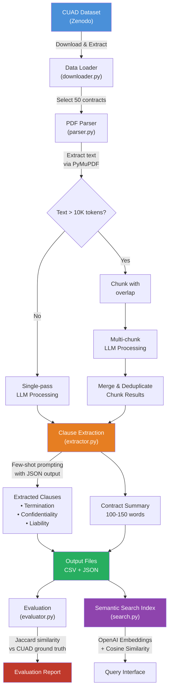

# Legal Contract Analysis Pipeline

An LLM-powered pipeline that analyzes legal contracts from the [CUAD dataset](https://www.atticusprojectai.org/cuad), extracts key clauses (Termination, Confidentiality, Liability), and generates concise summaries using Groq's blazing-fast LLM inference.

## Architecture & Flow Diagram



```
┌─────────────────────────────────────────────────────────────────┐
│                    PIPELINE FLOW (ASCII)                        │
├─────────────────────────────────────────────────────────────────┤
│                                                                 │
│  ┌──────────┐    ┌──────────┐    ┌──────────────┐              │
│  │ Download  │───>│  Parse   │───>│   Normalize  │              │
│  │ CUAD v1   │    │  PDFs    │    │   + Chunk    │              │
│  └──────────┘    └──────────┘    └──────┬───────┘              │
│                                         │                       │
│                                         ▼                       │
│                              ┌─────────────────────┐           │
│                              │   LLM Processing     │           │
│                              │  (gpt-4o-mini)       │           │
│                              │                       │           │
│                              │  ┌─────────────────┐ │           │
│                              │  │ Clause Extraction│ │           │
│                              │  │ (few-shot)       │ │           │
│                              │  └─────────────────┘ │           │
│                              │  ┌─────────────────┐ │           │
│                              │  │ Summarization    │ │           │
│                              │  │ (100-150 words)  │ │           │
│                              │  └─────────────────┘ │           │
│                              └──────────┬──────────┘           │
│                                         │                       │
│                         ┌───────────────┼───────────────┐      │
│                         ▼               ▼               ▼      │
│                  ┌────────────┐  ┌────────────┐  ┌──────────┐  │
│                  │  CSV/JSON  │  │ Evaluation  │  │ Semantic │  │
│                  │  Output    │  │  Report     │  │ Search   │  │
│                  └────────────┘  └────────────┘  └──────────┘  │
│                                                                 │
└─────────────────────────────────────────────────────────────────┘
```

## Setup

### Prerequisites
- Python 3.9+
- A Groq API key (free at [console.groq.com](https://console.groq.com)) or an OpenAI API key

### Installation

```bash
# Clone the repository
git clone <repository-url>
cd contract-analysis-pipeline

# Install dependencies
pip install -r requirements.txt

# Set your Groq API key (recommended — free and fast)
export GROQ_API_KEY="your-groq-api-key-here"
# On Windows:
set GROQ_API_KEY=your-groq-api-key-here

# OR use OpenAI instead:
# export OPENAI_API_KEY="your-openai-key-here"
```

## Usage

### Run the Full Pipeline

```bash
# Process 50 contracts (default)
python main.py

# Process a smaller subset for testing
python main.py --contracts 10

# Use OpenAI models instead of Groq
python main.py --model gpt-4o-mini

# Enable verbose logging
python main.py --verbose
```

### Semantic Search (Bonus)

After running the pipeline, search over extracted clauses:

```bash
python main.py --search "limitation of liability capping"
python main.py --search "termination for convenience 30 days notice"
python main.py --search "non-disclosure of confidential information"
```

## Approach

### 1. Data Loading & Preprocessing
- The CUAD v1 dataset (510 contracts) is automatically downloaded from Zenodo.
- A deterministic subset of 50 contracts is selected using evenly-spaced sampling across the alphabetically sorted list, ensuring diversity across contract types.
- PDF text is extracted using **PyMuPDF** (fitz), with a fallback to pre-extracted TXT files.
- Text normalization includes: removing SEC boilerplate/confidentiality legends, fixing encoding artifacts, collapsing whitespace, and removing page numbers.

### 2. Chunking Strategy
- Contracts exceeding ~10K tokens are split into overlapping chunks at paragraph boundaries.
- Each chunk has ~500 tokens of overlap with the previous chunk to avoid cutting clauses mid-sentence.
- For multi-chunk contracts, each chunk is processed separately and results are merged via a dedicated LLM consolidation call.

### 3. Prompt Engineering
- **Clause Extraction**: Uses a structured system prompt defining the three clause types with clear descriptions. Includes **two few-shot examples** (one with all three clauses present, one with a missing confidentiality clause) to calibrate the model's extraction behavior. Outputs structured JSON via `response_format={"type": "json_object"}`.
- **Summarization**: Separate prompt with explicit 100–150 word constraint, covering purpose, obligations, and risks. Includes a programmatic word-count validation with automatic retry if outside the target range.
- **Model**: Uses `llama-3.3-70b-versatile` on Groq by default for its excellent performance and free tier availability. Also supports OpenAI models via `--model gpt-4o-mini` flag. The pipeline auto-detects which API key is set (`GROQ_API_KEY` or `OPENAI_API_KEY`).

### 4. Evaluation
- Compares LLM-extracted Termination and Liability clauses against CUAD's human annotations using:
  - **Jaccard similarity** on token sets (measures text overlap)
  - **Detection accuracy** (did the model correctly identify presence/absence of a clause?)
- Confidentiality clauses are not evaluated against ground truth since CUAD does not contain a dedicated Confidentiality category.

### 5. Semantic Search (Bonus)
- All extracted clauses and summaries are vectorized using a lightweight TF-IDF approach (no external API required).
- Search queries are vectorized and compared via cosine similarity.
- The index is persisted to disk for fast reuse.

## Output Format

### CSV (`output/contracts_analysis.csv`)
| Column | Description |
|--------|-------------|
| `contract_id` | Contract filename (stem) |
| `summary` | 100–150 word contract summary |
| `termination_clause` | Extracted termination conditions |
| `confidentiality_clause` | Extracted confidentiality obligations |
| `liability_clause` | Extracted liability limitations |

### JSON (`output/contracts_analysis.json`)
Same structure as CSV, formatted as a list of objects.

## Project Structure

```
├── main.py                  # CLI entrypoint
├── requirements.txt         # Dependencies
├── README.md                # This file
├── .gitignore               # Git ignore rules
├── core/
│   ├── __init__.py          # Package init
│   ├── downloader.py        # Dataset download & subset selection
│   ├── parser.py            # PDF parsing & text normalization
│   ├── extractor.py         # LLM clause extraction & summarization
│   ├── search.py            # Semantic search with embeddings
│   └── evaluator.py         # Ground truth evaluation
└── output/                  # Generated at runtime
    ├── contracts_analysis.csv
    ├── contracts_analysis.json
    ├── evaluation_metrics.json
    ├── search_metadata.json
    ├── search_tfidf.npy
    └── search_vocab.json
```

## Limitations & Future Work
- **Confidentiality evaluation**: CUAD lacks a dedicated Confidentiality category, so ground-truth evaluation is limited to Termination and Liability clauses.
- **PDF quality**: Some CUAD PDFs have OCR artifacts or complex table layouts that may affect extraction quality.
- **Model comparison**: The pipeline supports swapping models via `--model` flag (e.g., `gpt-4o-mini` vs `llama-3.3-70b-versatile`) for comparative analysis.
- **Scalability**: For production use, consider async API calls, caching, and a vector database (e.g., FAISS, Pinecone) for the search index.

## License

This project uses the CUAD dataset, which is licensed under [CC BY 4.0](https://creativecommons.org/licenses/by/4.0/).
